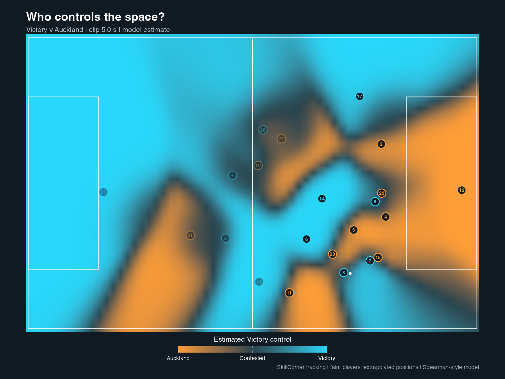
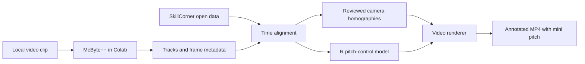

# Melbourne Victory · Pitch Control

A football analysis prototype by Jackson Sbrissa: synchronize open tracking data with broadcast footage, estimate spatial control in R, and display it directly on the pitch with a synchronized mini-pitch inset.

**Case study:** Melbourne Victory vs Auckland FC, 17 May 2025, A-League semi-final leg one. SkillCorner match ID: `2017461`. The 11.3-second sequence covers play leading into a Valadon shot.



## What an analyst can see

- How estimated team control changes as players move and the ball progresses.
- Team-coloured shirt numbers on the footage and a full-pitch view of the same moment.
- The influence of off-camera players, with a sensitivity diagnostic for extrapolated positions.

Cyan favours Melbourne Victory; orange favours Auckland. At each location, the model asks which team would be more likely to control a hypothetical ball sent there, using player position, velocity, reaction time and ball travel time. This is an instantaneous spatial-control surface. It is not an occupancy heatmap, pass-success model or goal probability.

The MP4 is shared separately. This repository contains code, reviewed calibration inputs and a pitch-only example figure; footage, model weights and large generated datasets are excluded. The project currently runs as an offline analysis pipeline.

## Pipeline



McByte++ supplies video tracks and frame timing for review. The final control model and shirt labels use SkillCorner positions and roster identities. A final mapping from McByte track IDs to player identities has not been assigned.

## Start with the match data

Requires R and an internet connection. Open `MelbVictoryDashboard.Rproj`, then run:

```r
source("setup.R")
source("get_match_data.R")
```

This downloads match metadata, extrapolated tracking, dynamic events and phases of play, including the actual Git LFS tracking payload. It loads `match`, `tracking`, `dynamic_events` and `phases_of_play` into R. The tracking download is about 86 MB.

## Reproduce the clip analysis

Full reproduction requires the **same local `MV_Clip.mp4`** used for calibration: 1280×720, 25 fps, about 11.335 seconds. The video is not distributed here. Existing anchors are specific to this sequence; a different clip requires new timing and camera review.

1. Install FFmpeg (`ffmpeg` and `ffprobe` on PATH), R dependencies above, and Python dependencies:

   ```sh
   python3 -m pip install -r requirements.txt
   ```

2. Open [McBytePlusPlus_Colab.ipynb](McBytePlusPlus_Colab.ipynb) in Google Colab. Select a GPU runtime and run cells in order. Upload the clip when prompted. The notebook extracts numbered frames, installs dependencies in a separate Python environment, downloads pretrained weights, runs tracking and exports results. It includes fixes for headless OpenCV, Colab's Matplotlib backend and GPUs without BF16 support.

3. Put `MV_Clip.mp4` in the project root. Copy the Colab exports `MV_Clip_tracks.csv` and `MV_Clip_metadata.json` into `data/processed/mv_clip/`. The included metadata records the original run; replace it with your matching export. Keep the reviewed JSON calibration files in that directory.

4. Run from the project root:

   ```sh
   python3 sync_clip_time.py
   python3 project_clip_positions.py
   Rscript pitch_control_model.R
   Rscript render_pitch_control.R
   Rscript plot_pitch_control.R
   Rscript add_mini_pitch.R
   ```

5. Open `data/processed/mv_clip/MV_Clip_pitch_control_minipitch.mp4`. To explore tables in R, run `source("load_synced_clip.R")`.

Each R script above executes its default operation when sourced. Rendering and model calculation run locally without a GPU; McByte++ inference uses the Colab GPU. The saved McByte++ run used revision `be1bbc03f18e33e93e0a359bbcbfdfc4dc4ab6b9`; the notebook currently clones the upstream default branch and records its revision, so future results may differ.

## Methods and interpretation

| Component | Working settings / evidence |
|---|---|
| Timing | Period 1; SkillCorner seconds ≈ `1133.3 + source_video_seconds`. Event-checked estimate, with ±0.2 s working review tolerance. |
| Sampling | 113 clip frames at 10 fps; SkillCorner frames 13843–13955. |
| Camera | Corner-projection proxy plus corrections fitted to 78 approximate manual ground contacts across six keyframes. |
| Spatial review | 40 separate manual observations: median error 20.9 px, 90th percentile 35.6 px, maximum 56.0 px at 1280×720. |
| Control model | 64×42 grid; reaction time 0.7 s; maximum travel speed 5 m/s; ball speed 15 m/s; arrival SD 0.45 s; control rate 4.3/s. |
| Video | Translucent grass-masked surface, team-coloured shirt labels, and a synchronized 300×196 px mini pitch. |

The R model is an independently written educational adaptation of arrival-time pitch control. It has not been fitted or probability-calibrated against match outcomes. Numerical mass conservation and convergence checks establish calculation consistency, not predictive accuracy.

All 22 player positions are included, including extrapolations. A detected-only comparison measures sensitivity to off-camera inputs; its average full-pitch absolute difference is approximately 0.21 for this clip. This diagnostic is not a confidence interval. No goalkeeper bonus or offside filtering is applied.

Timing and camera alignment remain approximate. Review anchors were selected by the same reviewer, with provisional player correspondences. Video shading can drift; the grass mask can affect coloured clothing. Interpretation should retain these limitations.

Detailed notes: [time synchronization](docs/TIME_SYNC.md), [camera alignment](docs/SPATIAL_ALIGNMENT.md), [pitch-control model and rendering](docs/PITCH_CONTROL.md).

## Project files

| File | Purpose |
|---|---|
| `get_match_data.R` | Download and load SkillCorner match data. |
| `McBytePlusPlus_Colab.ipynb` | GPU tracking, frame extraction and export. |
| `sync_clip_time.py` | Match video frame timing to SkillCorner samples. |
| `project_clip_positions.py` | Fit camera corrections, project players and render a review overlay. |
| `pitch_control_model.R` | Estimate arrival-time control and extrapolation sensitivity. |
| `render_pitch_control.R` | Project the control surface onto footage. |
| `plot_pitch_control.R` | Produce a standalone pitch chart. |
| `add_mini_pitch.R` | Add the synchronized pitch chart to the MP4. |
| `load_synced_clip.R` | Load saved analysis tables into R. |
| `data/processed/mv_clip/*.json` | Curated timing, calibration, review anchors and original metadata. |

Generated outputs stay under `data/processed/mv_clip/`. Modify model settings in `pitch_control_parameters()`; adjust rendering opacity with `render_pitch_control(opacity = 0.35)` after sourcing its script. Re-review spatial anchors whenever the time offset or clip changes.

## Credits and source repositories

This project builds on open data, tracking software and publicly shared football analytics methods. Credit belongs to their authors and contributors:

- **[SkillCorner / opendata](https://github.com/SkillCorner/opendata)** — match metadata, player and ball tracking, dynamic events, phases of play and field-of-view projections. Primary data source.
- **[tstanczyk95 / McBytePlusPlus](https://github.com/tstanczyk95/McBytePlusPlus)** — McByte++ tracking software and pretrained-model setup used by the Colab notebook. Upstream code and weights remain external dependencies.
- **[Friends of Tracking / LaurieOnTracking](https://github.com/Friends-of-Tracking-Data-FoTD/LaurieOnTracking)** — educational arrival-time pitch-control implementation informing reaction, velocity, ball travel and competing team control.
- **[thecomeonman / CodaBonito](https://github.com/thecomeonman/CodaBonito)** — R pitch-control examples and football plotting methods informing the R approach.
- **[mkh1991 / pitch-control](https://github.com/mkh1991/pitch-control)** — modular pitch-control implementation informing model structure and calculation design.
- **[Vsll92 / football-pitch-control](https://github.com/Vsll92/football-pitch-control)** — visual inspiration for team-colour control surfaces and contested regions.
- **A-Leagues** — source highlights, titled *Melbourne Victory v Auckland FC – Shark Highlights | Isuzu UTE A-League 2024-25 | Semi-Final Leg One*, published 17 May 2025. Broadcast footage is not included in this repository.

The local R control model and renderer are independently written; the research repositories above are references rather than installed dependencies. Each upstream project, dataset, pretrained model and video retains its own terms and attribution requirements. Publishing this code does not grant rights to redistribute those materials.

## Development

This is an independent prototype, not an official Melbourne Victory or SkillCorner product. Possible next steps include tighter camera calibration, reviewed track-to-player identity matching, additional sequences and an analyst-facing Shiny interface.

For changes, describe the football question, affected pipeline stage and assumptions. Include reproducible inputs where redistribution is permitted; avoid committing video, weights, credentials or generated bulk data.
